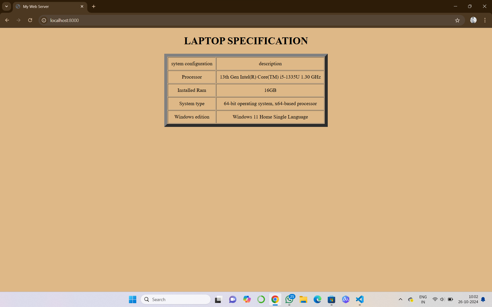
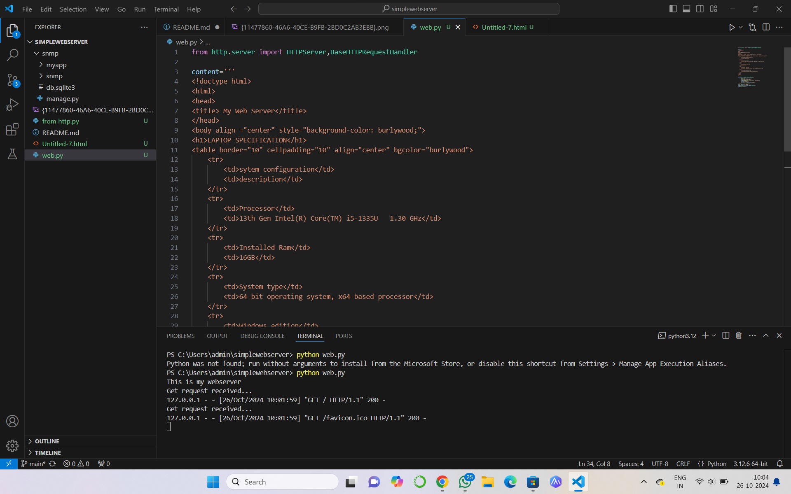

# EX01 Developing a Simple Webserver
## Date:
24-10-24
## AIM:
To develop a simple webserver to serve html pages and display the configuration details of laptop.

## DESIGN STEPS:
### Step 1: 
HTML content creation.

### Step 2:
Design of webserver workflow.

### Step 3:
Implementation using Python code.

### Step 4:
Serving the HTML pages.

### Step 5:
Testing the webserver.

## PROGRAM:
```
from http.server import HTTPServer,BaseHTTPRequestHandler

content='''
<!doctype html>
<html>
<head>
<title> My Web Server</title>
</head>
<body align ="center" style="background-color: burlywood;">
<h1>LAPTOP SPECIFICATION</h1>
<table border="10" cellpadding="10" align="center" bgcolor="burlywood">
    <tr>
        <td>sytem configuration</td>
        <td>description</td>
    </tr>
    <tr>
        <td>Processor</td>
        <td>13th Gen Intel(R) Core(TM) i5-1335U   1.30 GHz</td>
    </tr>
    <tr>
        <td>Installed Ram</td>
        <td>16GB</td>
    </tr>
    <tr>
        <td>System type</td>
        <td>64-bit operating system, x64-based processor</td>
    </tr>
    <tr>
        <td>Windows edition</td>
        <td>Windows 11 Home Single Language</td>
    </tr>
</table>
</body>
</html>
'''

class MyServer(BaseHTTPRequestHandler):
    def do_GET(self):
        print("Get request received...")
        self.send_response(200) 
        self.send_header("content-type", "text/html")       
        self.end_headers()
        self.wfile.write(content.encode())

print("This is my webserver")
server_address =('',8000)
httpd = HTTPServer(server_address,MyServer)
httpd.serve_forever()
```

## OUTPUT:


## RESULT:
The program for implementing simple webserver is executed successfully.